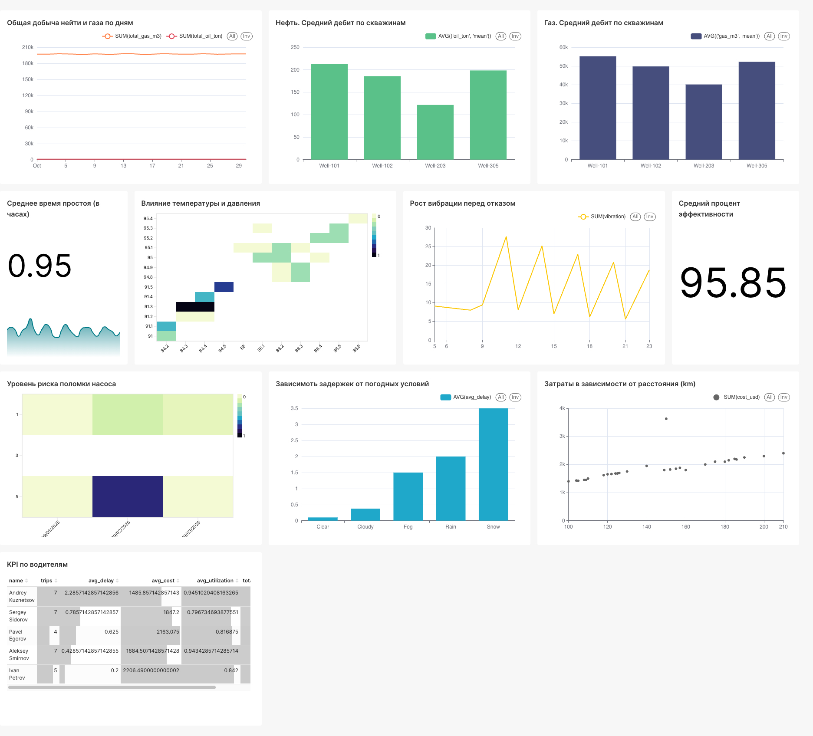

Задание по дисциплине Семинар наставника по теме Big Data и ML.
Для сборки проекта
1. склонировать проект на локальную машину
2. в корне проекта docker-compose up -d
3. на порту 8888 в директории /work/notebooks запустить скрипты по очереди из ноутбуков data_prep и debit_prediction
4. после чего на порту 8088 перейти в интерфейс superset и в правом верхнем углу выбрать Import dashboards
5. выбрать архив из папки dashboard

Итоговый дашборд выглядит так

